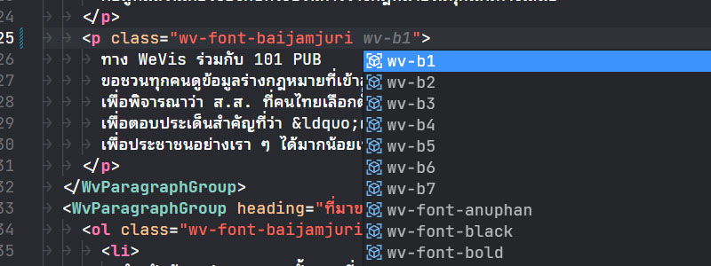
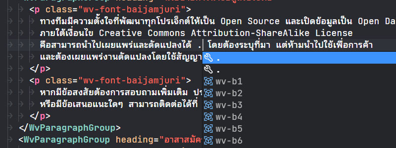
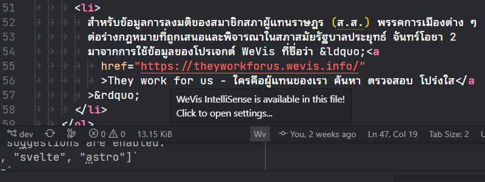
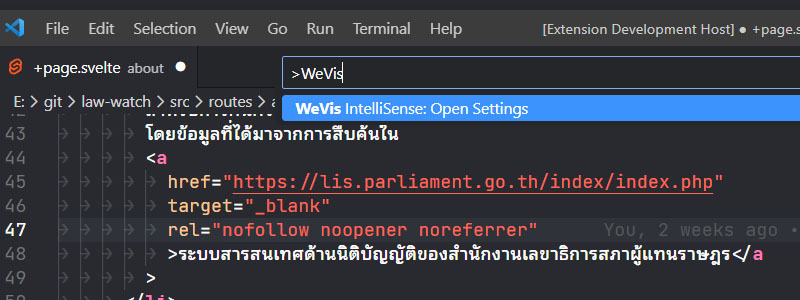

# WeVis IntelliSense

VSCode IntelliSense for [WeVis Design System](https://wevisdemo.github.io/design-systems/).

## Features

Autosuggest available CSS classes from the design system in several files format such as HTML (.html), Vue (.vue), React (.js, .jsx, .tsx), Svelte (.svelte), Astro (.astro). It works on the pattern `` class[Name]=[{]<"|'|`> ``; if the pattern matched, it will try to suggest you.

This extension also works with Emmet, so you can type `.` and it will start suggesting you. This is enabled by default, but you can disable this functionality in the settings.

To provide a clear status whether the extension is available in the file, if the autosuggestion is available in a particular file, there will be a small "Wv" at the status bar.

To open the extension's settings, you can use a command "WeVis IntelliSense: Open Settings" via the command palette (`ctrl/cmd + shift + p`), or pressing the text "Wv" at the status bar.

For upcoming features and plan, please see [Planned Features](#planned-features).

## Extension Settings

There are 3 settings available in this extension:

- `wevis-intellisense.allowEmmet`
  - Allow suggestion with Emmet abbreviation.
  - Default: `true`
- `wevis-intellisense.htmlLanguages`
  - A list of HTML based languages where suggestions are enabled.
  - Default: `["html", "vue", "vue-html", "svelte", "astro"]`
- `wevis-intellisense.javaScriptLanguages`
  - A list of JavaScript based languages where suggestions are enabled.
  - Default: `["javascript", "javascriptreact", "typescriptreact"]`

## Planned Features

- [x] Autosuggestion
- [ ] Snippets
  - [ ] Component Snippets
  - [ ] Cookbook Snippets
- [ ] Component Generator

## Release Notes

- **1.0.0**: First release with basic suggest functionality.
